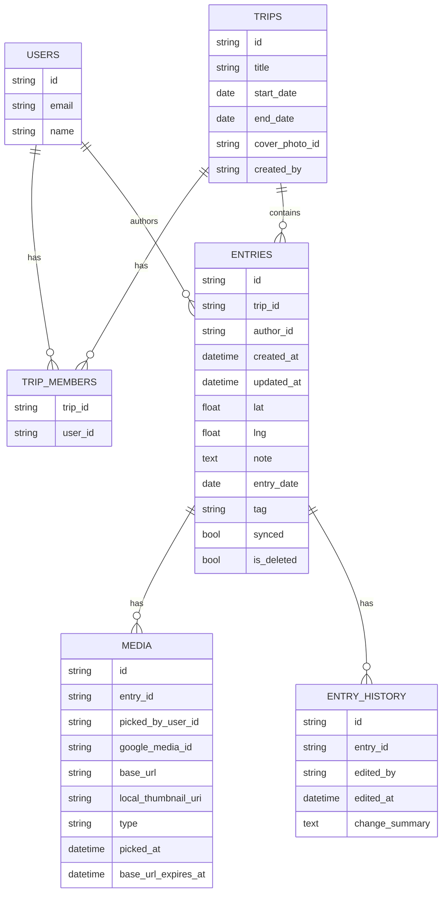
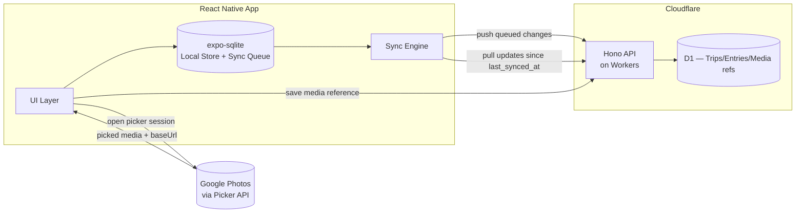
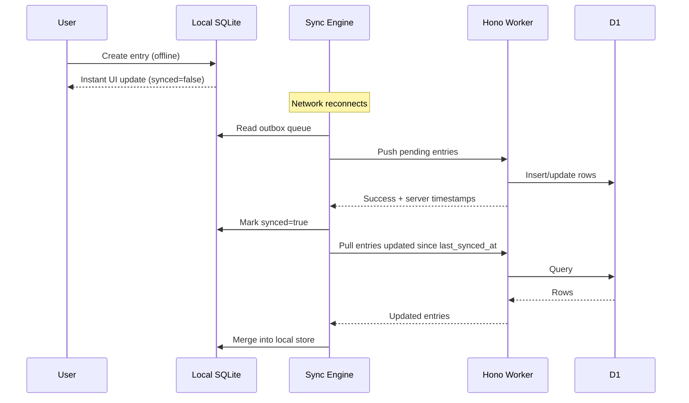

# Travel Logging App — Technical Decision Document

## 1. Overview

A shared travel logging app for two users (one trip, both contribute). Built React Native (frontend) and Hono on Cloudflare Workers (backend), with offline support as a v1 requirement.

## 2. Tech Stack Decisions

| Layer | Choice | Rationale |
|---|---|---|
| Mobile frontend | React Native (Expo) | Leverages existing React experience; Expo simplifies camera/location/photo access and OTA updates |
| Navigation | Expo Router | File-based routing, less boilerplate |
| Server state | TanStack Query | Pairs with Hono's typed RPC client; built-in caching/retry |
| Local state | Zustand | Lightweight, minimal boilerplate for UI-only state |
| Local storage | expo-sqlite | Structured local store needed for offline queue + entry cache, not just key-value |
| Backend framework | Hono | Lightweight, first-class Cloudflare Workers support, typed RPC client (`hc`) gives end-to-end type safety without codegen |
| Backend hosting | Cloudflare Workers | Low latency, generous free tier, pairs naturally with D1/R2 |
| Relational data | Cloudflare D1 (SQLite) | Trips/entries/users are relational; D1 fits Workers natively |
| Media storage | Google Photos (via Picker API) | Existing albums already live there; avoids duplicating storage/sync pipeline for v1 |
| Auth | Simple email/password or magic link, JWT sessions | Only two users — a full OAuth provider is unnecessary overhead |

## 3. Data Model

One trip, shared by both users via `trip_members`. Entries carry `author_id` for attribution, but all reads are scoped to `trip_id` — no per-user data silos.

## 4. System Architecture

## 5. Offline-First Sync Design

This is the highest-risk part of the build and is designed deliberately rather than retrofitted:

1. **Local-first writes** — every entry is created immediately in local SQLite with a client-generated UUID and a `synced` flag. The UI never blocks on network.
2. **Sync queue (outbox)** — a table of pending creates/updates/photo-uploads. A background task runs on app foreground and network reconnect, walking the queue and pushing to the API.
3. **Conflict resolution** — last-write-wins by `updated_at`. With only two authors on one trip, simultaneous edits to the same entry are rare enough that CRDTs are unnecessary complexity.
4. **Photos** — attached via the Google Photos Picker API rather than uploaded to app-owned storage. Since you and your wife each have separate Google accounts, each authorizes the Picker individually with your own OAuth token — `picked_by_user_id` on the `media` row tracks whose library a photo came from. Picking requires an active connection and can happen at any time (not just entry creation/edit) — entries support adding photos later. Once picked, a small thumbnail is downloaded and cached locally (`local_thumbnail_uri`) so it remains viewable offline afterward; only the *picking* action itself requires connectivity. Entries with no cached thumbnail yet show a placeholder tile with an offline indicator. `base_url` values from Google expire, so the full-resolution image is re-fetched on view rather than cached long-term — only the thumbnail is kept locally.
5. **Pull sync** — on reconnect, fetch entries where `updated_at > last_synced_at` for the trip and merge into the local store.

## 6. V1 Features Beyond Core Logging

- **Tags/categories** — each entry carries a `tag` (food/sight/activity/accommodation, etc.). Cheap addition to the schema now; feeds both search and stats.
- **Search/filter within a trip** — filter entries by date, tag, or keyword match against `note`. Straightforward query against local SQLite (and D1 server-side) once tags exist.
- **Trip stats/summary** — computed from existing entry data: days traveled (from `start_date`/`end_date`), locations visited, entry counts by tag. No new storage needed — a derived view over entries.
- **Map view** — pins for each entry plotted using existing `lat`/`lng`, likely via `react-native-maps`. The natural payoff of already capturing location per entry.
- **Entry edit/delete history** — since past trips remain always-editable, changes are tracked via an `entry_history` table (who edited, when, summary of the change) rather than silent overwrites. Deletes are soft (`is_deleted` flag) rather than destructive, so history stays intact and entries remain recoverable.
## 7. Order of Development

1. **Backend foundation** — D1 schema, Hono CRUD for trips/trip_members/entries, deploy to Workers
2. **Auth** — simple two-user email/password or magic link, JWT sessions
3. **Local data layer** — SQLite schema mirroring server shape + outbox/sync queue table
4. **App shell with local-first writes** — entry creation works fully offline before wiring to any API
5. **Sync engine** — push queue, pull updates, network state via `@react-native-community/netinfo`
6. **Media integration** — per-user Google Photos Picker auth, attach-anytime flow, local thumbnail caching, offline placeholder + indicator UI
7. **Tags, search, and stats** — tag field on entries, filter UI, derived trip summary view
8. **Map view** — plot entries on a map using existing lat/lng data
9. **Edit/delete history** — `entry_history` tracking, soft-delete for entries
## 8. Decisions

- **Past trips remain editable** — no read-only/"completed" lock state needed.
- **No export in v1** — PDF/shareable trip summaries deferred to a later phase.
- **Push notifications are a nice-to-have** — not required for v1, worth revisiting once core sync is stable.